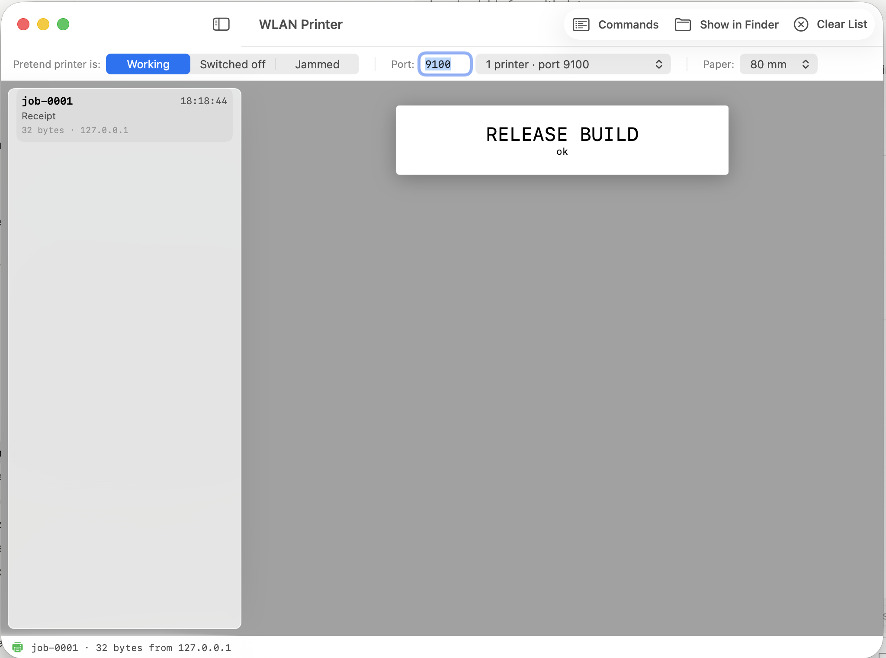

# WLAN Printer Emulator

A virtual network receipt printer for macOS. It listens on TCP port 9100 like a
real thermal printer, and draws whatever is printed to it as a receipt in a
window instead of on paper.

Useful when you are building point-of-sale software and do not want to keep a
thermal printer plugged in to test the WiFi/LAN print path — including the parts
that are awkward to test with real hardware, like a printer that is switched off
or jammed mid-job.



## Why a TCP listener is a complete printer

Network thermal printers speak "raw" ESC/POS over port 9100: the client opens a
socket, writes command bytes, and closes. Nothing is ever read back. Discovery
is typically a connect-scan across the local subnet on that port, so a socket
that merely accepts is a discoverable printer.

That makes an emulator straightforward — the interesting work is decoding the
byte stream back into something a human can look at.

## Install

Download `WLAN-Printer.zip` from the
[latest release](../../releases/latest), unzip it, and drag `WLAN Printer.app`
to your Applications folder.

The app is ad-hoc signed rather than notarized, so on first launch macOS will
refuse to open it. Right-click the app and choose **Open**, then confirm. Or
from a terminal:

```bash
xattr -dr com.apple.quarantine "/Applications/WLAN Printer.app"
```

macOS will also ask to allow incoming network connections the first time — that
prompt is the listener, and it needs allowing.

## Use

1. Launch the app. The empty window shows the addresses it is reachable at.
2. In the app you are testing, add a WiFi/LAN printer at `<that IP>:9100`.
3. Print. The receipt appears in the window.

The controls:

| Control | What it does |
| --- | --- |
| **Pretend printer is: Working / Switched off / Jammed** | Simulates printer conditions. *Switched off* refuses every connection; *Jammed* accepts a job then stops reading half-way. Use them to exercise error handling, timeouts and retries. |
| **Port** | The TCP port to listen on. 9100 is the raw-printing convention; change it if something else on your machine already owns it. |
| **1 printer / 2 printers** | Runs a second emulator on the next port, so you can pair a cashier printer and a kitchen printer at once and check each receipt reaches the right one. |
| **Paper** | 58 mm or 80 mm paper width. |
| **Commands** | Shows the decoded ESC/POS command trace for the selected job. |
| **Show in Finder** | Opens the folder of saved jobs. |

Every job is saved to
`~/Library/Application Support/WlanPrinterEmulator/jobs/`, as the exact bytes
received (`raw.bin`), the decoded command trace (`trace.txt`), and a PNG per
image.

## What it decodes

Text with alignment, bold, underline, inverted video and the width/height
multipliers; cash-drawer pulses; cuts (each one starts a new sheet in the view);
barcodes and QR codes (shown as their payload, not drawn as scannable symbols);
and both image paths:

- **`GS v 0`** raster images.
- **`ESC *`** bit images. This one is easy to get wrong: a common encoder
  rotates the source image 270°, slices it into 24-dot-tall strips and emits one
  `ESC *` chunk per strip with a newline between them. The chunks have to be
  stitched back together vertically, and those separating newlines must not be
  treated as line breaks, or logos come out as stripes.

TSPL/TSC label jobs are detected and shown as their plain-text commands.

## Headless version

`tools/wlan_printer_emulator.py` is a standalone Python 3 script with the same
decoder and no dependencies at all — no pip install, no Tk. It writes each job
as raw bytes, a command trace, PNGs, and an HTML receipt preview. Use it for CI,
on Linux, or when you want files rather than a window.

```bash
python3 tools/wlan_printer_emulator.py --no-gui --out ./jobs
```

## Build from source

Requires Xcode's Swift toolchain. No Xcode project, no package manager:

```bash
./build.sh
open "WLAN Printer.app"
```

## Limitations

- Receipts are drawn with a system monospace font, not the printer's actual
  glyph cell, so line wrapping at the paper edge will not match a real printer
  exactly. The command trace is authoritative for column counts.
- Barcodes and QR codes are shown as their payload text, not rendered as
  scannable symbols.
- Codepage handling covers CP437; other codepages are decoded as CP437.

## License

MIT — see [LICENSE](LICENSE).
